# Retail Store Sales Data Analysis

## 📖 Overview
This project analyzes a dataset of sales record in a retail store with over 12,500 rows covering the customer IDs, product details, transaction dates, revenue etc. The analysis was done under the topic **Customer Behavior and Sales Performance** answering business questions such as,

- Who are the top customers?
- What are the most popular items and categories?
- How do sales trends change over time?
- Does location or payment method impact spending?

## 🛠 Tools & Technologies
1. Python - Performed data clean-ups like checking for duplicates, formatting columns etc. using Pandas and validating calculated columns using NumPy. Visualized the findings using Matplotlib and Seaborn.
2. PostgreSQL - Wrote problem-specific queries and built data tables tailored to each analysis task.
3. VS Code - Used as the development environment for writing and managing both SQL & Python scripts.

## 📂 Data Source
+ Kaggle - [Link for the dataset](https://www.kaggle.com/datasets/ahmedmohamed2003/retail-store-sales-dirty-for-data-cleaning?resource=download)
+ The raw data contains 12575 rows and 11 columns

## 🔄 Workflow
### Data Cleaning Procedure on Python
+ Imported the raw dataset into Python along with the necessary libraries.
```python
# Import Libraries

import pandas as pd
import numpy as np
```
```python
# Import .csv files

df = pd.read_csv('C:/Users/DELL/Documents/Road to Data Analytics/Data Analytics Projects/Retail Store Sales/retail_store_sales.csv')
```
+ Checked for missing values in the important columns like Customer ID, Transcation ID, Transaction date etc.
```python
# How many values are missing per column?
df.isnull().sum()
```
+ Fixed the data types of columns like Transaction Date and Quantity
```python
## Transaction Date - datetime
df['Transaction Date'] = pd.to_datetime(df['Transaction Date'], errors='coerce')

## Quantity - integer
df['Quantity'] = df['Quantity'].fillna(0).astype(int)
```
+ Checked for consistency in the 'Total Spent' column by manually creating a calculated column
```python
# Does the manually calculated column match with 'Total Spent' column?
df['calculated_total'] = df['Price Per Unit'] * df['Quantity']
```
+ Replaced the values of 'Total Spent' column with the manually calculated column
```python
# Replacing the values of 'Total Spent' col with the values of 'calculated_total' col
df["Total Spent"] = df["calculated_total"]
```
+ Deleted the manually created columns afterwards
```python
# Getting rid of the 'calculated_total' col
df = df.drop(columns=["calculated_total"])
```
+ Checked for duplicate values in the 'Transaction ID' column
```python
# Checking if there's any duplicate value in the 'Transaction ID' col 
df['Transaction ID'].duplicated().any()
```
+ Exported the clean dataframe as .csv file
```python
# Exporting to .csv
df.to_csv("data_clean.csv", index=False) # index=False avoids writing row numbers
```
### Importing the CSV file into PostgreSQL and Querying
+ Created a table for the dataset
```SQL
CREATE TABLE retail_sales (
    Transaction_ID VARCHAR(100),
    Customer_ID VARCHAR(100),
    Category VARCHAR(100),
    Item VARCHAR(100),
    Price_Per_Unit DECIMAL(10,2),
    Quantity NUMERIC,
    Total_Spent DECIMAL(10,2),
    Payment_Method VARCHAR(50),
    Location_ VARCHAR(100),
    Transaction_Date DATE,
    Discount_Applied BOOLEAN
);
```
+ Imported the dataset into the table
```SQL
-- Importing the .csv file
COPY retail_sales
FROM 'C:\Postgres Imports\retail_stores_data_clean.csv'
WITH (FORMAT csv, HEADER true);
```
+ Checking if the dataset is working properly
```SQL
SELECT *
FROM retail_sales
```
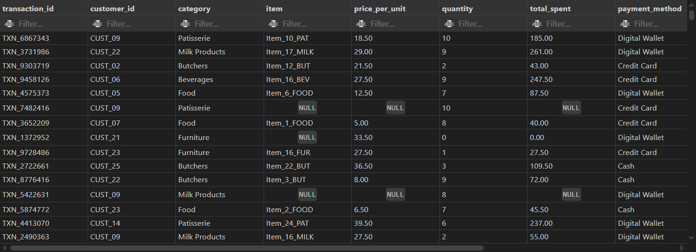

+ Wrote queries for each case
```sql
/* Top performing products and categories */

-- Top 5 most popular categories (by quantities sold)
SELECT
    category,
    SUM(quantity) AS total_no_of_quantities_sold
FROM
    retail_sales
GROUP BY
    category
ORDER BY
    total_no_of_quantities_sold DESC
LIMIT
    5;

-- Top 10 items by revenue
SELECT
    item,
    SUM(total_spent) AS "Total Sales"
FROM
    retail_sales
GROUP BY
    item
ORDER BY
    "Total Sales" DESC
LIMIT 10;
```
```sql
/* Customer Analysis */

-- Top 10 customers
SELECT
    customer_id,
    sum(total_spent) AS "Total Spending"
FROM
    retail_sales
GROUP BY
    customer_id
HAVING
    sum(total_spent) IS NOT NULL
ORDER BY
    "Total Spending" DESC
LIMIT 10;

-- Average Spending per Customer
SELECT
    avg("Total Spending") AS average_spending_per_cutomer
FROM(
    SELECT
    customer_id,
    sum(total_spent) AS "Total Spending"
FROM
    retail_sales
GROUP BY
    customer_id
HAVING
    sum(total_spent) IS NOT NULL
) AS cutomer_spending;
```
```sql
/* Monthly Sales Trend */

SELECT
    transaction_date,
    total_spent
FROM
    retail_sales
WHERE
    total_spent IS NOT NULL;

-- Monthly Sales Trend
SELECT
    TO_CHAR(transaction_date, 'YYYY-MM') AS "Sale Month",
    TO_CHAR(transaction_date, 'Month') AS "Month Name",
    SUM(total_spent) AS "Monthly Revenue"
FROM
    retail_sales
WHERE
    total_spent IS NOT NULL
    AND
    TO_CHAR(transaction_date, 'YYYY-MM') LIKE '%2022%'
GROUP BY
    "Sale Month",
    "Month Name"
ORDER BY
    "Sale Month" ASC;

-- Sales by day of the week
SELECT
    EXTRACT(DOW FROM transaction_date) AS day_of_week_number,
    TO_CHAR(transaction_date, 'Day') AS day_of_week_name,
    sum(total_spent)
FROM
    retail_sales
WHERE
    total_spent IS NOT NULL
GROUP BY
    day_of_week_number,
    day_of_week_name
ORDER BY
    day_of_week_number;
```
```sql
/* Location & Payment Analysis */

-- Average Transaction Value by Location
SELECT
    location_ AS "Location",
    avg(total_spent) AS "Average Transaction"
FROM
    retail_sales
WHERE
    total_spent IS NOT NULL
GROUP BY
    "Location";

-- Total Sales by Payment Method
SELECT
    payment_method,
    sum(total_spent) AS "Total Sales"
FROM
    retail_sales
WHERE
    total_spent IS NOT NULL
GROUP BY
    payment_method
ORDER BY
    "Total Sales" DESC;
```
```sql
/* Discount Effectiveness Analysis */
SELECT
    CASE
        WHEN discount_applied = TRUE THEN 'Discount Applied'
        ELSE 'No Discount Applied'
    END AS discount_status,
    count(*) AS "Total Transactions",
    sum(total_spent) AS "Total Revenue"
FROM
    retail_sales
WHERE
    discount_applied IS NOT NULL
    AND
    total_spent IS NOT NULL
GROUP BY
    discount_status;
```
```sql
/*Top Selling products by Location*/
WITH ItemRevenueByLocation AS (
SELECT
    location_,
    item,
    SUM(total_spent) AS item_revenue_by_location,
    -- Rank the items within each location partition
    ROW_NUMBER() OVER (PARTITION BY location_ ORDER BY SUM(total_spent) DESC) AS rank_by_revenue
FROM
    retail_sales
GROUP BY
    location_,
    item
)
    -- Select only the top 3 items for each location
SELECT
    location_,
    item,
    item_revenue_by_location
FROM
    ItemRevenueByLocation
WHERE
    rank_by_revenue <= 3
ORDER BY
    item_revenue_by_location DESC;
```

### Preparing the SQL queries for visualizing in Python
+ Imported all the necessary libraries
```python
import psycopg2
import pandas as pd
import matplotlib.pyplot as plt
import seaborn as sns
```
+ Connected the python script to the SQL database
```python
# Connect to database
conn = psycopg2.connect(
    dbname = "projects_personal",
    user = "CONFIDENTIAL",
    password = "CONFIDENTIAL",
    host = "localhost",
    port = "5432"
)
```
+ Wrote Python codes for visualizations
  - **Top-Performing Products and Categories**
  
1. Top 5 Most Popular Categories (by Quantity Sold)
```python
query = """
SELECT
    category,
    SUM(quantity) AS total_no_of_quantities_sold
FROM
    retail_sales
GROUP BY
    category
ORDER BY
    total_no_of_quantities_sold DESC
LIMIT
    5;
"""
```
```python
df = pd.read_sql_query(query,conn)

df
```
```python
df_grouped = df.groupby("category")["total_no_of_quantities_sold"].sum().sort_values(ascending=True)

ax = df_grouped.plot(kind="barh",figsize=(8,6))

# Add labels
for i, v in enumerate(df_grouped):
    ax.text(v-200,i,f"{int(v):,}", va='center', ha='right', color='white', fontsize=9)

# Add Titles and labels
plt.xlabel("Quantity")
plt.ylabel("Category")
plt.title("Top 5 Categories By Quantities Sold")
plt.tight_layout()
plt.show
```
2. Top 5 Items by Revenue
```python
query = """
SELECT
    item,
    SUM(total_spent) AS "Total Sales"
FROM
    retail_sales
GROUP BY
    item
ORDER BY
    "Total Sales" DESC
LIMIT 5;
"""
```
```python
df=pd.read_sql_query(query,conn)

df
```
```python
df_grouped=df.groupby("item")["Total Sales"].sum().sort_values(ascending=True)

ax = df_grouped.plot(kind="barh",figsize=(8,6))

# Add labels
for i,v in enumerate(df_grouped):
    ax.text(v-200,i,f"${int(v):,}", va='center', ha='right', color='white', fontsize=9)

# Add titles and Labels
plt.xlabel("Revenue ($)")
plt.ylabel("Item")
plt.title("Top 5 Items by Revenue")
plt.tight_layout()
plt.show
```
+    + **Customer Analysis**
1. Top 10 Customers 
```python
query = """
SELECT
    customer_id,
    sum(total_spent) AS "Total Spending"
FROM
    retail_sales
GROUP BY
    customer_id
HAVING
    sum(total_spent) IS NOT NULL
ORDER BY
    "Total Spending" DESC
LIMIT 10;
"""
```
```python
df = pd.read_sql_query(query,conn)

df
```
```python
df_grouped=df.groupby("customer_id")["Total Spending"].sum().sort_values(ascending=False)

ax = df_grouped.plot(kind="bar",figsize=(8,6))

# Add labels
for i,v in enumerate(df_grouped):
    ax.text(i,v,f"${int(v):,}", ha='center', va='bottom', color='black', fontsize=9)

# Add titles and Labels
plt.xlabel("Customer ID")
plt.ylabel("Expenditure")
plt.title("Top 10 Highest Paying Customers")
plt.tight_layout()
plt.show
```
2. Average Spending Per Customer
```python
query = """
SELECT
    avg("Total Spending") AS average_spending_per_cutomer
FROM(
    SELECT
    customer_id,
    sum(total_spent) AS "Total Spending"
FROM
    retail_sales
GROUP BY
    customer_id
HAVING
    sum(total_spent) IS NOT NULL
) AS cutomer_spending;
"""
```
```python
df = pd.read_sql_query(query,conn)

df
```
+   - **Monthly Sales Trend**
1. Monthly Sales Trend for 2022
```python
query = """
SELECT
    TO_CHAR(transaction_date, 'YYYY-MM') AS "Sale Month",
    TO_CHAR(transaction_date, 'Month') AS "Month Name",
    SUM(total_spent) AS "Monthly Revenue"
FROM
    retail_sales
WHERE
    total_spent IS NOT NULL
    AND
    TO_CHAR(transaction_date, 'YYYY-MM') LIKE '%2022%'
GROUP BY
    "Sale Month",
    "Month Name"
ORDER BY
    "Sale Month" ASC;
"""
```
```python
df = pd.read_sql_query(query,conn)

df
```
```python
df_grouped=df.groupby("Sale Month")["Monthly Revenue"].sum()

ax = df_grouped.plot(kind="line",figsize=(8,6))

# Add labels
for i,v in enumerate(df_grouped):
    ax.text(i,v,f"${int(v):,}", ha='center', va='bottom', color='black', fontsize=8)

# Add titles and Labels
plt.xlabel("Month")
plt.ylabel("Revenue")
plt.title("Monthly Sales Trend 2022")
plt.tight_layout()
plt.show
```
2. Monthly Sales Trend for 2023
```python
query = """
SELECT
    TO_CHAR(transaction_date, 'YYYY-MM') AS "Sale Month",
    TO_CHAR(transaction_date, 'Month') AS "Month Name",
    SUM(total_spent) AS "Monthly Revenue"
FROM
    retail_sales
WHERE
    total_spent IS NOT NULL
    AND
    TO_CHAR(transaction_date, 'YYYY-MM') LIKE '%2023%'
GROUP BY
    "Sale Month",
    "Month Name"
ORDER BY
    "Sale Month" ASC;
"""
```
```python
df = pd.read_sql_query(query,conn)

df
```
```python
df_grouped=df.groupby("Sale Month")["Monthly Revenue"].sum()

ax = df_grouped.plot(kind="line",figsize=(8,6))

# Add labels
for i,v in enumerate(df_grouped):
    ax.text(i,v,f"${int(v):,}", ha='center', va='bottom', color='black', fontsize=8)

# Add titles and Labels
plt.xlabel("Month")
plt.ylabel("Revenue")
plt.title("Monthly Sales Trend 2023")
plt.tight_layout()
plt.show
```
3. Monthly Sales Trend for 2024
```python
query = """
SELECT
    TO_CHAR(transaction_date, 'YYYY-MM') AS "Sale Month",
    TO_CHAR(transaction_date, 'Month') AS "Month Name",
    SUM(total_spent) AS "Monthly Revenue"
FROM
    retail_sales
WHERE
    total_spent IS NOT NULL
    AND
    TO_CHAR(transaction_date, 'YYYY-MM') LIKE '%2024%'
GROUP BY
    "Sale Month",
    "Month Name"
ORDER BY
    "Sale Month" ASC;
"""
```
```python
df = pd.read_sql_query(query,conn)

df
```
```python
df_grouped=df.groupby("Sale Month")["Monthly Revenue"].sum()

ax = df_grouped.plot(kind="line",figsize=(8,6))

# Add labels
for i,v in enumerate(df_grouped):
    ax.text(i,v,f"${int(v):,}", ha='center', va='bottom', color='black', fontsize=8)

# Add titles and Labels
plt.xlabel("Month")
plt.ylabel("Revenue")
plt.title("Monthly Sales Trend 2024")
plt.tight_layout()
plt.show
```
4. Sales by Day of the Week
```python
query = """
SELECT
    EXTRACT(DOW FROM transaction_date) AS day_of_week_number,
    TO_CHAR(transaction_date, 'Day') AS day_of_week_name,
    sum(total_spent)
FROM
    retail_sales
WHERE
    total_spent IS NOT NULL
GROUP BY
    day_of_week_number,
    day_of_week_name
ORDER BY
    day_of_week_number;
"""
```
```python
df = pd.read_sql_query(query,conn)

df
```
```python
# Create the line chart
plt.figure(figsize=(10, 6))
plt.plot(df['day_of_week_name'], df['sum'], marker='o', linestyle='-')

#Add data label
for x, y in zip(df['day_of_week_name'], df['sum']):
    plt.annotate(
        f'${int(y):,}', 
        (x, y), 
        textcoords="offset points", 
        xytext=(0, 7), 
        ha='center', 
        fontsize=9, 
        color='darkslategray',
        weight='bold'
    )

# Add labels and title
plt.title('Total Sales by day of the week')
plt.xlabel('Day of the Week')
plt.ylabel('Total Sales ($)')
```
+   - **Discount Effectiveness Analysis**
```python
query = """
SELECT
    CASE
        WHEN discount_applied = TRUE THEN 'Discount Applied'
        ELSE 'No Discount Applied'
    END AS discount_status,
    count(*) AS "Total Transactions",
    sum(total_spent) AS "Total Revenue"
FROM
    retail_sales
WHERE
    discount_applied IS NOT NULL
    AND
    total_spent IS NOT NULL
GROUP BY
    discount_status;
"""
```
```python
df = pd.read_sql_query(query,conn)

df
```
```python
# Creating figure and axis
fig, ax1 = plt.subplots(figsize=(8,5))

# Bar plot for transactions
sns.barplot(
    data=df,
    x='discount_status',
    y='Total Transactions',
    ax=ax1,
    color='skyblue'
)
ax1.set_ylabel('Total Transactions')
ax1.set_xlabel('') #hiding x label

    # Data Labels for Bar
for i, value in enumerate(df['Total Transactions']):
    ax1.text(i,value+30,      #(x,y) position
             f'{value:,}',    #format with comma
             ha = 'center', va = 'bottom', fontsize=10)    

# Line Plot for revenue
ax2 = ax1.twinx()
sns.lineplot(
    data=df,
    x='discount_status',
    y='Total Revenue',
    ax=ax2,
    color = 'red',
    marker = 'o'
)
ax2.set_ylabel('Total Revenue ($)')

    # Data Labels for Line
for i, value in enumerate(df['Total Revenue']):
    ax2.text(i,value-250,     #slightly above point
             f'$ {value:,.0f}',  #round to zero decimals
             color='red', ha='right',va='bottom',fontsize=10)

plt.title('Transactions and Revenue by Discount Status')
plt.xticks(rotation=0)
plt.tight_layout
plt.show
```
+   - **Granular Sales Trend (Day of Week v. Location)**
```python
query = """
SELECT
    EXTRACT(DOW from transaction_date) AS day_of_week_number,
    TO_CHAR(transaction_date, 'Day') AS day_of_week_name,
    sum(CASE
            WHEN location_ = 'In-store' THEN total_spent
            ELSE 0
        END) AS in_store_revenue,
    sum(CASE
            WHEN location_ = 'Online' THEN total_spent
            ELSE 0
        END) AS online_revenue,
    sum(total_spent) AS total_daily_revenue
FROM
    retail_sales
GROUP BY
    day_of_week_number,
    day_of_week_name
ORDER BY
    day_of_week_number;
"""
```
```python
df = pd.read_sql_query(query,conn)

df
```
```python
# Dataframe Melting
df_melted = df.melt(
    id_vars=["day_of_week_name"],
    value_vars=["in_store_revenue", "online_revenue"],
    var_name="location_type",
    value_name="revenue"
)

heatmap_data = df_melted.pivot_table(
    index="day_of_week_name",
    columns="location_type",
    values="revenue",
    aggfunc="sum"
)

# ✅ Force correct day order from original df (your df is already correct)
heatmap_data = heatmap_data.reindex(df["day_of_week_name"])

# $ formatted labels
labels = heatmap_data.applymap(lambda v: f'${v:,.0f}')

plt.figure(figsize=(10,6))
sns.heatmap(
    heatmap_data,
    annot=labels,
    fmt="",
    linewidths=.5,
    cmap="RdYlGn",
    cbar_kws={"format": "${:,.0f}".format}
)

plt.title("Revenue Heatmap by Day and Location Type")
plt.xlabel("")
plt.ylabel("")
plt.show()
```
+   - **Top Selling Products by Location**
```python
query = """
WITH ItemRevenueByLocation AS (
SELECT
    location_,
    item,
    SUM(total_spent) AS item_revenue_by_location,
    -- Rank the items within each location partition
    ROW_NUMBER() OVER (PARTITION BY location_ ORDER BY SUM(total_spent) DESC) AS rank_by_revenue
FROM
    retail_sales
GROUP BY
    location_,
    item
)

SELECT
    location_,
    item,
    item_revenue_by_location
FROM
    ItemRevenueByLocation
WHERE
    rank_by_revenue <= 3
ORDER BY
    item_revenue_by_location DESC;
"""
```
```python
df = pd.read_sql_query(query,conn)

df
```
```python
# Create Catplot
g =sns.catplot(
    data=df,
    x="item",
    y="item_revenue_by_location",
    hue="location_",
    kind="bar",
    palette= ["#0A3D91", "#6EC6FF"],
    height=4,
    aspect=2    
)

# x-label rotation
plt.xticks(rotation=0)

#Add Data Label
ax = g.ax
for container in ax.containers:
    labels = [f"${x:,.0f}" for x in container.datavalues]
    ax.bar_label(container, labels=labels, padding =3)

#Layout Adjustment
plt.tight_layout
plt.title("Top 3 Selling Products by Location")
plt.ylabel("Revenue by Location ($)")
plt.xlabel("Item")
plt.show
```

## 🔍 Findings
### Top-Performing Products and Categories
**1. What are the top 5 most popular categories (by quantity sold)?**

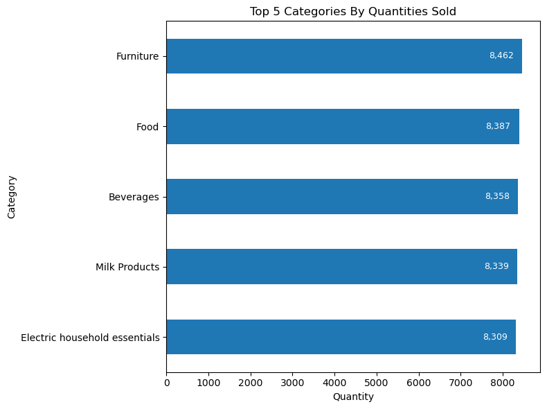

The 'Furniture' category leads slightly, and the rest show very close sales volume indicating competitive demand across these segments.

<u>Suggested Business Improvement Action</u>

Because the quantities sold are very close, the business could,

*Implement targeted promotional bundles for lower-ranked categories (i.e. Electrical Household Essentials + Milk Products)*

This helps:
+ Increase sales of items just below the top category
+ Encourage cross-category purchasing
+ Boost overall basket value


**2. What are the top 5 items that generated the most revenue?**

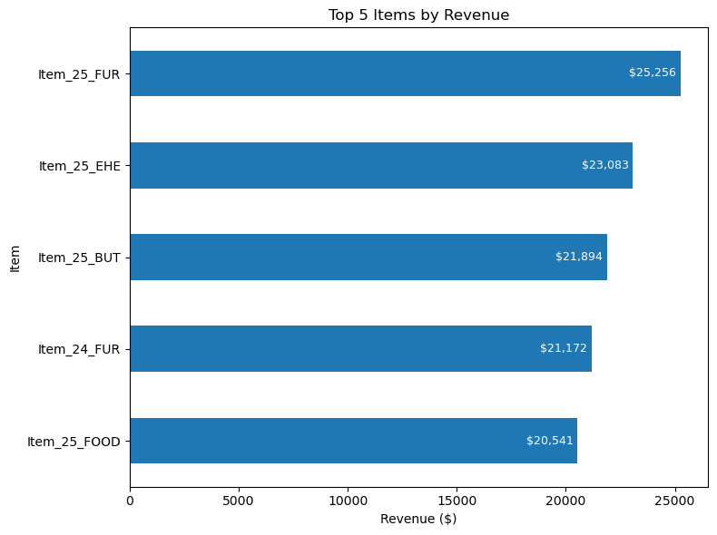

The data suggests that several item variants from the “Item_25” batch are consistently strong revenue performers across different categories.

<u>Suggested Business Improvement Action</u>

Since Item_25 variants are dominating sales,

*Consider expanding the Item_25 product line, offering:*
+ *New variations (sizes, bundles, flavors, colors)*
+ *Premium versions*
+ *Seasonal editions*

Additionally, because Furniture (FUR) appears twice in the top 5, the business could:  
*Promote accessories/upgrades related to Furniture to increase average transaction value.*  
This strategy could leverage existing customer interest while increasing potential revenue streams.

### Customer Analysis
**1. Who are the top 10 highest spending customers?**

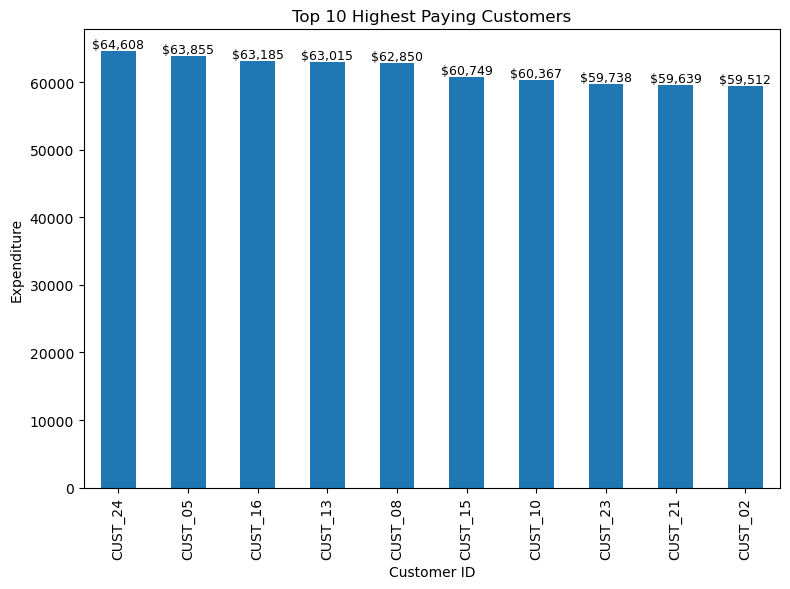

These customers form the business’s top-tier revenue contributors.

<u>Suggested Business Improvement Action</u>

Since spending values are clustered within a narrow range, the business would benefit from  
*Launching a High-Value Customer Loyalty Program
Offer perks such as:*
+ *early access to new products*
+ *exclusive discounts*
+ *personalized recommendations*
+ *VIP support*

This could help:
+ Increase retention among top spenders
+ Encourage additional purchase frequency
+ Strengthen lifetime customer value

**2. What is the average spending per customer?**

The average spending per customer based on the data is **$58,920**.

<u>Suggested Business Improvement Action</u>

Because the average spending is relatively high, it is recommended for the business to focus on  
*Introducing tier-based incentive programs around this benchmark*  
For Example,  
+ Customers near or slightly below the average (e.g., $50K–$58K) can be encouraged to increase spending through
    + threshold-based discounts (e.g., spend +$2K to receive 5% off)
    + bonus loyalty points
+ Customers already above average can be rewarded with
    + exclusive offers
    + early access to limited items
    + premium services

This strategy could
+ Motivate mid-tier customers to grow into top spenders
+ Improve loyalty among high-value customers
+ Increase overall revenue without discounting broadly

### Monthly Sales Trend
**1. What is the monthly sales trend for the years 2022, 2023 and 2024?**

**For 2022**


Highlights:
+ Strong start in January (highest month of the year).
+ Noticeable dips in March, October, and December.
+ Peaks around September.

*Behavior: volatile first year, inconsistent year-end demand.*

**For 2023**

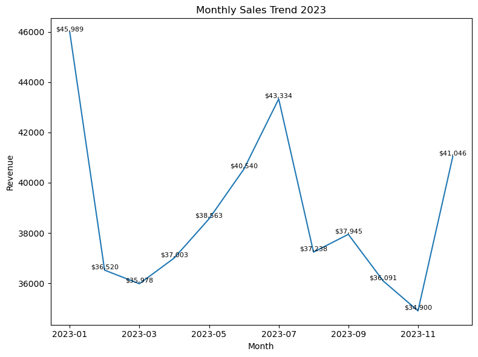

Highlights:
+ Similar dip pattern around February–March.
+ July shows a prominent growth spike.
+ November hits the lowest point in the year.
+ Year-end (December) shows a rebound.

*Behavior: consumer demand returns toward year-end, suggesting holiday uplift.*

**For 2024**

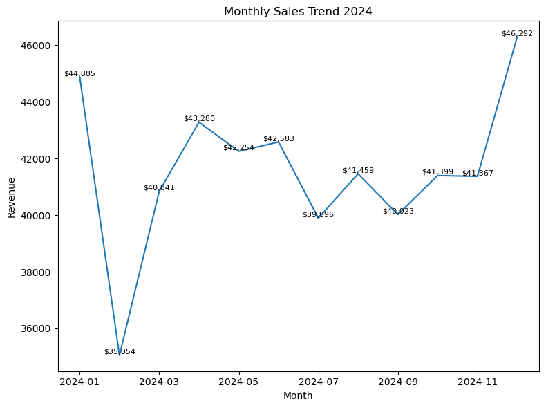

Highlights:
+ Revenue becomes more stable across the year.
+ April–June remain stronger than previous years.
+ December becomes the highest revenue month across all three years.
*Behavior: successful year-end sales strategy or demand improvement.*

**Across the three years**
+ There is no consistently strong seasonal spike, but general patterns do emerge.
+ Revenues fluctuate month-to-month, showing mild seasonality.
+ Comparing year-to-year trends shows gradual stabilization in 2024.

**Year to Year Comparisons**  
January
+ Starts very high in 2022
+ Dips in 2023, then slightly improves in 2024  
>*Indicates declining New Year demand*

Mid-year (May–August)
+ Shows gradual strengthening across the three years
>*Suggests improved mid-year sales campaigns or product-market fit.*

December
+ Rises consistently:  
    2022: $36.2K  
    2023: $41.0K  
    2024: $46.3K
>*Growing holiday demand momentum.*

**Notable Patterns**
+ February and March are consistently weaker across all years.
+ Year-end (November–December) improves over time.
+ 2024 shows the most balanced performance, indicating maturing sales strategy.

**Summary Trend Interpretation**  
|Year|Trend Summary|Performance Direction|
|----|-------------|---------------------|
|2022|Volatile, weak Q4|Baseline|
|2023|Strong mid-year, weak Q4|Slight decline
|2024|Strong holiday surge, stable months|Positive growth|

<u>Suggested Business Improvement Action</u>  
+ *Increase marketing and promotional activity during February–March to improve early-year sales dips.*
+ *Capitalize on Proven Holiday Growth*  
    *i.e. Increase advertising spend October–December and offer bundled deals to maximize peak season revenue*
+ *Increase or decrease stock around historically predictable months.*

**2. What are the sales by the days of week?**

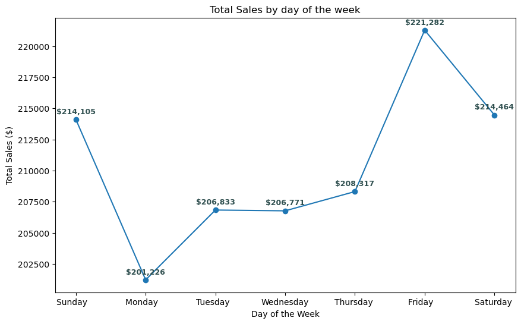

+ Friday has the highest sales - customers likely shop before the weekend.
+ Saturday & Sunday remain strong, indicating consistent weekend demand.
+ Monday is the weakest day, possibly due to reduced discretionary spending after weekend purchases.

<u>Pattern Summary</u>
+ Weekend + Friday = strongest revenue window
+ Early week (Mon–Wed) = lower engagement

<u>Suggested Business Improvement Action</u>  
*Run targeted promotions early in the week (especially Mondays) to lift the lowest-performing day and smooth weekly revenue.*

### Discount Effectiveness Analysis
**How do discounts impact total transactions and revenue compared to sales without discounts?**

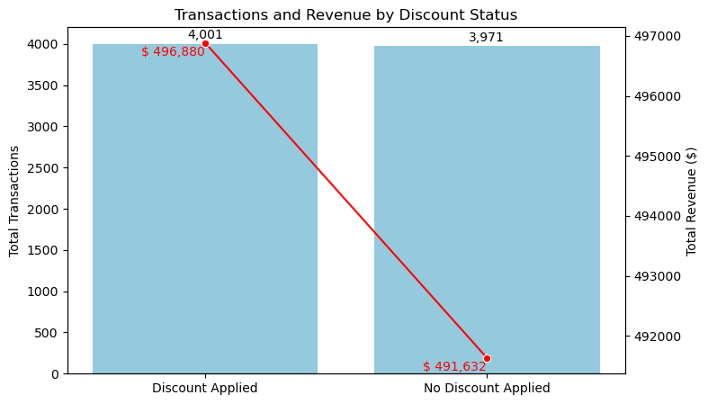

+ Discounted transactions slightly outperformed non-discounted transactions
+ Total revenue generated from discounted sales ($496,880.50) is also higher than revenue from non-discounted sales ($491,632.50).
+ This suggests that offering discounts increases purchase volume and still preserves strong revenue, likely by encouraging more conversions or larger baskets.

<u>Suggested Business Improvement Action</u>  
*Introduce limited, well-timed discount campaigns to boost transaction volume while maintaining healthy revenue levels.*

### Granular Sales Trend (Day of Week v. Location)
**Which sales channel (online vs. in-store) performs better overall, and how should the business respond to the performance difference?**

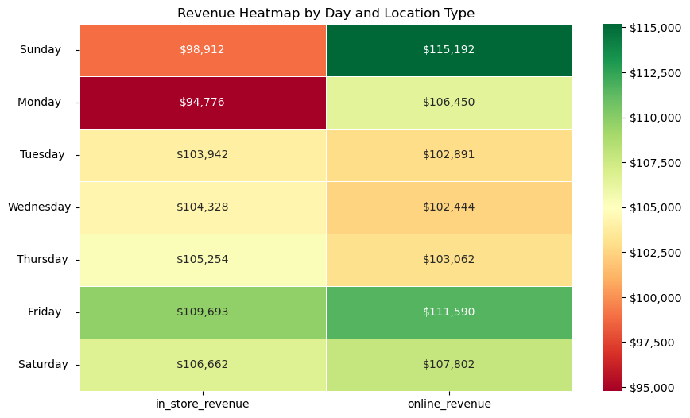

+ Online revenue is consistently higher than in-store revenue Monday–Sunday, except Tuesday–Thursday where the gap is narrower.
+ In-store revenue spikes on Friday, indicating increased foot traffic near the weekend.

<u>Key Insight</u>

+ Online sales represent a stronger, more reliable revenue stream, while in-store sales show event-driven spikes (especially near the weekend).

<u>Suggested Business Improvement Action</u>  
+ *Strenghthen the online channel further*
    + *Accelerate digital advertising spend*
    + *Improve mobile checkout experience*
    + *Offer free shipping or loyalty perks*  

>*This could maximize the strongest revenue engine.*

+ *Enhance the in-store weekend experience*
    + *Run Friday-only promotions or bundle deals*
    + *Add weekend staffing*
    + *Prioritize stock replenishment*

>*This could capitalize on natural store demand surges.*

### Top Selling Products by Location
**Which products generate the highest revenue by sales channel (in-store vs. online), and how should the business adjust merchandising and marketing strategy based on these patterns?**

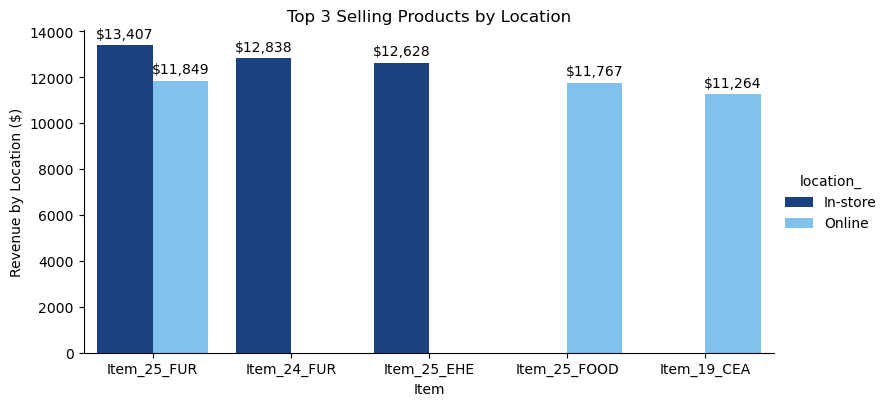

+ **In-Store**:  
    "Item_25_FUR" and "Item_24_FUR" dominate - customers likely respond to tactile evaluation.  
    "Item_25_EHE" suggests value or specification review is driving in-store purchases.
+ **Online**:  
    "Item_25_FUR" is channel-agnostic; consistently strong seller.
    "Item_25_FOOD" thrives online; likely convenience driven.
    "Item_19_CEA" may lack in-store visibility or shelf space, yet generates strong online demand.

<u>Cross-Channel Product Behavior</u>
|Product|In-Store Rank|Online Rank|Insight|
|-------|-------------|-----------|-------|
|Item_25_FUR|#1|#1|Universal popularity; prioritize inventory allocation|
|Item_24_FUR|#2|-|In-store exclusive strength; improve online merchandising|
|Item_25_EHE|#3|-|Consumers likely prefer physical evaluation|
|Item_25_FOOD|-|#2|Convenience purchase; promote subscription/auto-reorder|
|Item_19_CEA|-|#3|Online channel opportunity gap in-store|

<u>Suggested Business Improvement Action</u>

*Item_25_FUR*  
    - *Expand stock in both channels*  
    - *Offer bundles (delivery + assembly options)*  
    - *Feature prominent product placement online & in-store*

*Item_24_FUR*  
    - *Increase online visibility: add richer product imagery, reviews, and comparison tools*  
    - *Test targeted ads*

*Item_25_FOOD*  
    - *Promote online reorder/subscription frequency*  
    - *Offer curbside pickup for upsell opportunities*

*Item_19_CEA*  
    - *Trial in-store promotion or sampling*  
    - *Feature end-cap placement to increase discovery*

## Sales Forecasting (Bonus Task)
This activity forecasts the monthly revenues for the next 12 months. This forecast is critical for accurate budgeting, inventory management, and staffing decisions.

The analysis employed the Prophet time series model (developed by Meta/Facebook). Prophet is robust against missing data and adept at handling strong seasonality and holiday effects, which are characteristic of retail data.

**Input Data**: The model was trained on the time series derived from the query below
```sql
/*Sales Forecasting: Monthly Revenue Time Series*/

-- This query aggregates daily transactions into total monthly revenue,
-- which serves as the input data for the Prophet forecasting model.

SELECT
    transaction_date,
    total_spent
FROM
    retail_sales;

SELECT
    date_trunc('month',transaction_date) AS ds,
    sum(total_spent) AS y
FROM
    retail_sales
GROUP BY
    ds
ORDER BY
    ds;
```

+ ds (Datetime) - First day of the month  
+ y (metric) - The total monthly revenue

**Python Operation**
```python
# Importing the libraries

import pandas as pd
import matplotlib.pyplot as plt
import matplotlib.dates as mdates
from prophet import Prophet
```
```python
# 1. Data Loading and Preparation

try:
    df = pd.read_csv('sales_forecast_data.csv')
except FileNotFoundError:
    print("ERROR: sales_forecast_data.csv. Please ensure the file is present")
    exit()

# Prophet requires the columns to be named specifically: 'ds' for the date and 'y' for the metric.
df['ds'] = pd.to_datetime(df['ds'])
df['ds'] = df['ds'].dt.tz_localize(None)

df
```
```python
# 2. Model Initializing and Training

# Initialize the Prophet model.
# We explicitly enable 'yearly_seasonality' because retail sales have strong annual cycles (e.g., holidays).
m = Prophet(
    yearly_seasonality=True,
    daily_seasonality=False,
    weekly_seasonality=False,
    seasonality_mode='multiplicative' # Use multiplicative mode for retail; seasonality spikes tend to grow with the trend
)

# Fit the model to the historical data
m.fit(df)
```
```python
# 3. Future Dataframe creation

# Create a DataFrame for 12 months into the future.
# 'freq="MS"' means Month Start frequency.

future = m.make_future_dataframe(periods=12, freq='MS')
```
```python
# 4. Prediction

# Make the forecast
forecast = m.predict(future)
```
```python
# 5. Visualization

print("Sales Forecast Summary (Next 12 Months)")
print(forecast[['ds','yhat','yhat_lower','yhat_upper']].tail(12).to_string(index=False))

# Plot the forecast
fig, ax = plt.subplots(figsize=(14,7))

# Plot the actual historical data
ax.plot(df['ds'], df['y'], 'k.', label ='Historical Sales')

# Plot the predicted line (yhat)
ax.plot(forecast['ds'], forecast['yhat'], color = 'blue', linestyle ='-', label = 'Predicted Sales')

# Plot the confidence interval (yhat_lower, yhat_upper)
ax.fill_between(
    forecast['ds'],
    forecast['yhat_lower'],
    forecast['yhat_upper'],
    color = 'skyblue',
    alpha = 0.4,
    label = '95% Confidence Interval'
)

# Highlight the forecast period
historical_end_date = df['ds'].max()
ax.axvline(x=historical_end_date, color='red', linestyle='--', label='End of Historical Data')

# Formatting the plot
ax.set_title('Sales Forecasting', fontsize=18)
ax.set_xlabel('Date', fontsize=14)
ax.set_ylabel('Total Revenue ($)', fontsize=14)
ax.legend(loc='upper left')
ax.grid(True, which='both', linestyle='--', linewidth=0.5)

# Improve X-axis date formatting
ax.xaxis.set_major_formatter(mdates.DateFormatter('%Y-%m'))
ax.xaxis.set_major_locator(mdates.MonthLocator(interval=3))
plt.xticks(rotation=45, ha='right')
plt.tight_layout()
plt.show()
```
```python
# 6. Plotting Trend and Seasonality Components

# This is a key part of Prophet analysis, showing the model's breakdown of the time series
m.plot_components(forecast)
plt.show
```

**Key Forecasting Results**

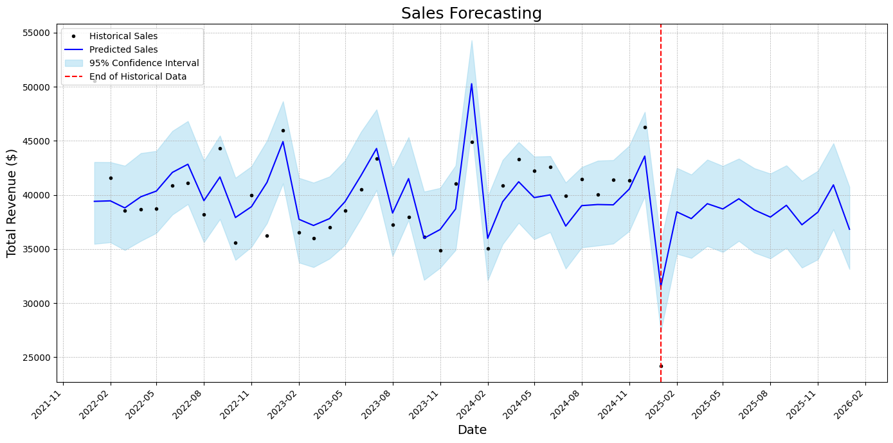
+ The model identified a clear and consistent annual seasonality pattern with a predictable peak during the year-end holiday season and a post-holiday trough. The confidence interval is relatively tight, indicating the model is highly certain of the range within which the actual revenue will fall.

**Suggested Business Improvement Actions**  
+ *Inventory & Purchasing:  
The model predicts a clear peak in December 2025 ($40,931). The purchasing team must use this figure as a base for inventory stocking and ensure sufficient supply to meet the 11% increase in demand anticipated between November and December. The actual sales number is predicted to fall between $36,821 and $44,771.*

+ *Budgeting & Cost Control:  
The forecast confirms a predictable post-holiday drop in revenue, with January 2026 revenue ($36,828) falling to the model's lowest point. Management should budget conservatively during Q1 2026, tightening discretionary spending and optimizing labor schedules immediately following the December peak to protect margins.*

+ *Marketing Strategy:  
Since sales velocity starts increasing in Q4 (culminating in the December peak), marketing efforts should be heavily concentrated and front-loaded in October and November to maximize customer acquisition leading into the highest-value month.*

## 📌 Access Files
+ Data File (.csv) - [File Location](https://github.com/krisshanr98/Retail_Store_Analytics_Project/blob/main/data_clean.csv)
+ SQL Files - [File Location](https://github.com/krisshanr98/Retail_Store_Analytics_Project/tree/main/sql_scripts)
+ Python files - [File Location]

## 📄 License
This project is open source for learning and personal portfolio use.
Feel free to fork or adapt.

## ✏ Author
Built by Krisshan Rajkumar as part of a personal data analytics portfolio.